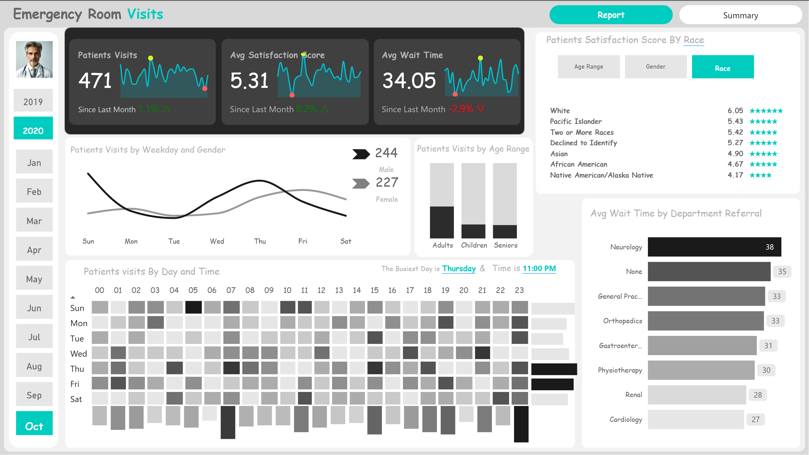
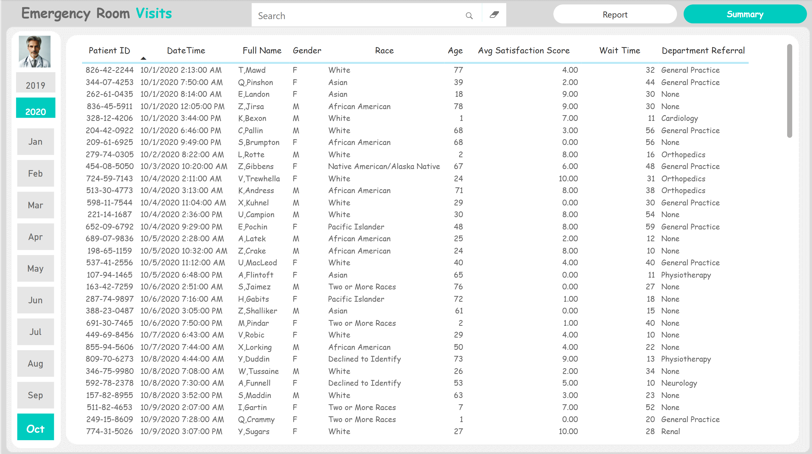
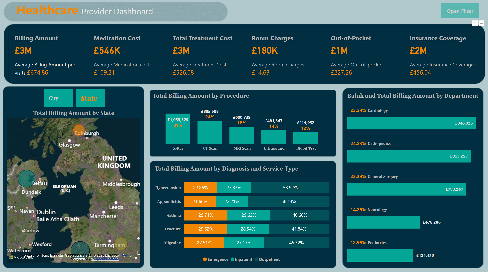
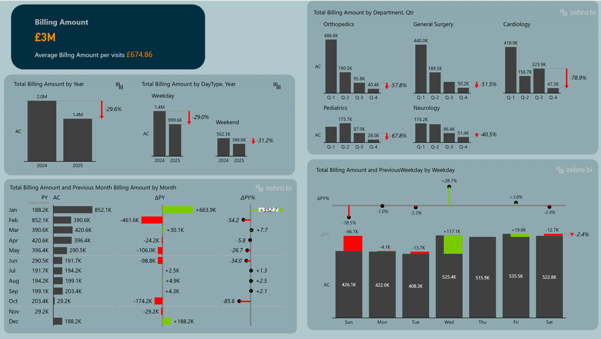

<h1 align="center"> Emergency Room Visits Analysisg  </h1>

  In this project, I analyzed Emergency Room visit data to support decision-making related to performance improvement.
 The dashboard identifies time-based visit patterns, peak hours, bottlenecks such as long wait times by department, and variations in patient satisfaction by demographic group.

  <b>🔹  Analytical Questions  🔹</b>

✅ Overall Performance:
> How many patients visited the Emergency Room this month? Has it increased or decreased compared to last month?
> 
> What is the average patient satisfaction score? Has it improved compared to the previous month?
> 
> What is the average wait time? Has it gone up or down?

✅ Time Distribution:
> Which days of the week are the busiest?
> 
> What are the peak hours during the day?
> 
> Which specific day and time experience the highest volume of visits? (Thursday at 11:00 PM)

✅ Patient Demographics:
> What is the gender distribution of patients (male vs. female)?
> 
> Which age group visits the ER the most? (Children, Adults, Seniors)

✅ Patient Satisfaction:
> How does patient satisfaction vary by race, gender, or age?
> 
> Example: White patients have the highest satisfaction (6.05), while Native American/Alaska Native patients have the lowest (4.17).

✅ Wait Time by Referral Department:
> Which department has the longest average wait time? (Answer: Neurology – 38 minutes)
> 
> Which departments need operational improvement to reduce wait times?

  
  

  <b>⬅Check</b> &nbsp;&nbsp;&nbsp;&nbsp; <b>➡️</b>

---
# 🏥 Healthcare Provider  Projects

A collection of healthcare analytics dashboards and insights powered by **Power BI** and **DAX**.  
Focus areas include patient billing, procedure cost distribution, departmental revenue analysis, and regional performance.

#### 📌 Key Insights

 **💰 Financial Overview**

 
- **Insurance Coverage:** ~66.7% of total healthcare costs
- **Out-of-Pocket Expenses:** ~33.3%
> ✅ While insurance plays a dominant role in covering treatment costs,  
> ❗ the out-of-pocket share remains a **significant financial burden** for many patients.

**🖼️ Imaging Procedure Billing**

- **Top Contributors:** X-Ray, CT Scan, MRI
- **Combined Share:** **73%** of total procedural billing  
> 🧠 **Imaging procedures are the primary revenue drivers** in healthcare.  
> ⚠️ This may indicate **high demand or overreliance**, informing investment and cost strategies.

**🩺 Chronic Disease Management**

- **Hypertension:** 53.92% billed as **outpatient**  
> ✅ This suggests it is being **managed effectively without emergency care**.  
> 💡 Use this trend to improve outpatient care plans and reduce avoidable ER visits.

**🧭 Geographic Billing Patterns****
- **High Billing Cities:** London, Birmingham, Dublin  
- **Lower Billing Regions:** Glasgow and surrounding areas  
> 📊 **Billing varies significantly by region.**  
> 🔍 Opportunity for **targeted investments** in lower-performing areas through:
  - Infrastructure enhancements
  - Community outreach programs

    
### Billing Analysis: Key Insights

 **1. Year-over-Year Billing Drop**

**🧾 Insight:**
> There has been a significant 29.6% drop in total billing from 2024 to 2025. This decline may indicate underlying issues affecting overall revenue.

**2. Weekday vs. Weekend Billing**

**🧾 Insight:**
> Billing decreased across both weekdays and weekends, with weekend billing experiencing a steeper decline. Possible drivers could include changes in customer behavior or operational inefficiencies.

**3. Departmental Decline**

**🧾 Insight:**
> Every department experienced a significant billing decline, with Cardiology and Pediatrics hit the hardest. Potential causes may include patient volume drops or operational challenges.

**4. Monthly Billing Fluctuations**

**🧾 Insight:**
> January’s spike may reflect a post-holiday backlog or rescheduled procedures from December. However, the overall yearly trend remains negative, signaling weaker demand in subsequent months.

**5. Weekday Billing Patterns**

**🧾 Insight:**
> Weekday billing is generally more stable and efficient, while weekend billing—especially Sundays—underperforms.

    
#### Documentation
- [Documentation](Doc/HospitalBilling.pdf)
- [Video](https://www.linkedin.com/posts/hegazy-ahmed_powerbi-dax-dataanalytics-activity-7330721837372403712-aQRb?utm_source=share&utm_medium=member_desktop&rcm=ACoAADcRge4BCiq6ISTAKxBtggfkK4mfvjG5IyA)

#### 📈 Tools Used
- Power BI  
- DAX  
- Data Modeling  
- Data Visualization

  
---
