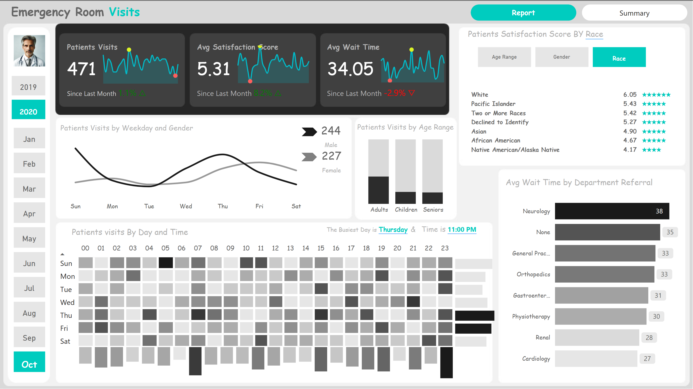
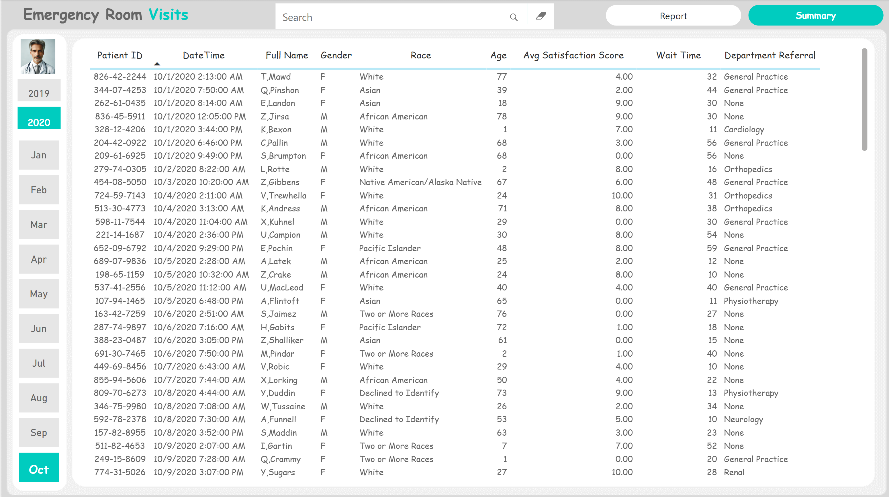
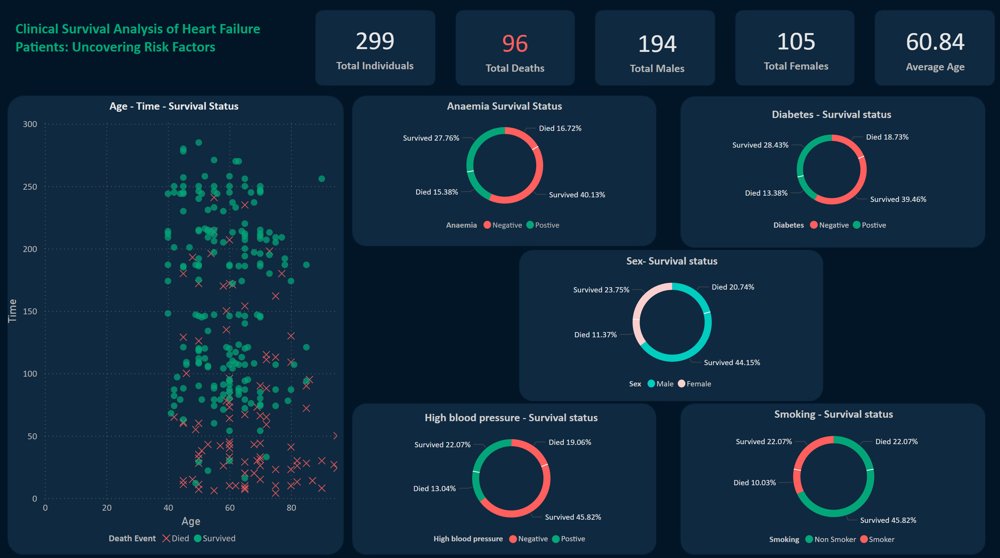
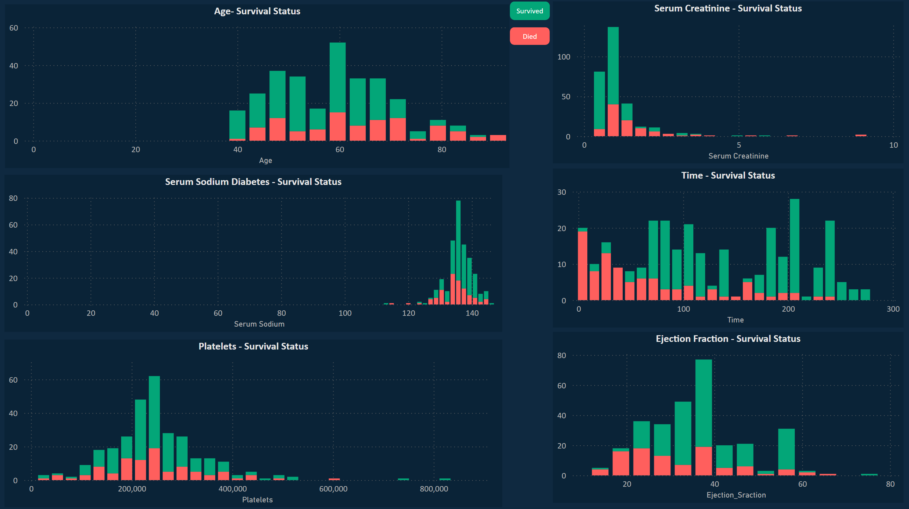
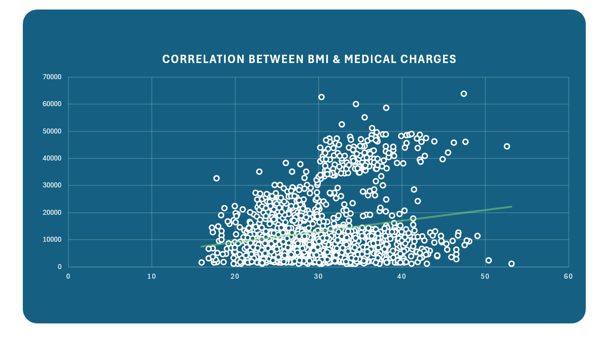
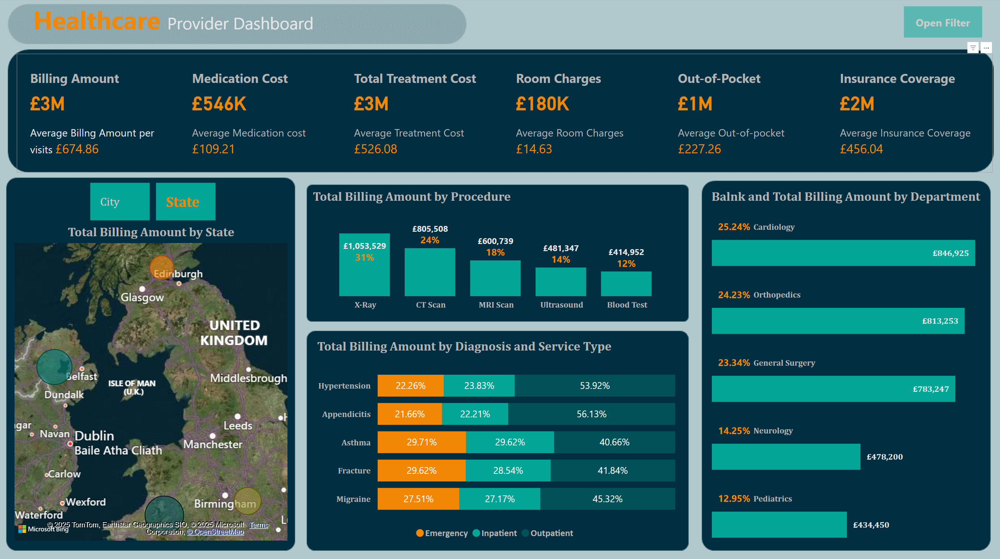
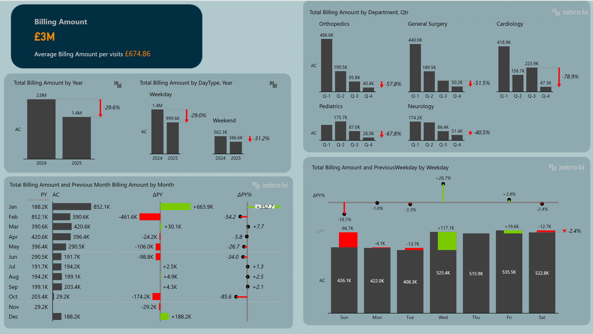

<h1 align="center"> Emergency Room Visits Analysisg  </h1>

  In this project, I analyzed Emergency Room visit data to support decision-making related to performance improvement.
 The dashboard identifies time-based visit patterns, peak hours, bottlenecks such as long wait times by department, and variations in patient satisfaction by demographic group.

  <b>🔹  Analytical Questions  🔹</b>

✅ Overall Performance:
> How many patients visited the Emergency Room this month? Has it increased or decreased compared to last month?
> 
> What is the average patient satisfaction score? Has it improved compared to the previous month?
> 
> What is the average wait time? Has it gone up or down?

✅ Time Distribution:
> Which days of the week are the busiest?
> 
> What are the peak hours during the day?
> 
> Which specific day and time experience the highest volume of visits? (Thursday at 11:00 PM)

✅ Patient Demographics:
> What is the gender distribution of patients (male vs. female)?
> 
> Which age group visits the ER the most? (Children, Adults, Seniors)

✅ Patient Satisfaction:
> How does patient satisfaction vary by race, gender, or age?
> 
> Example: White patients have the highest satisfaction (6.05), while Native American/Alaska Native patients have the lowest (4.17).

✅ Wait Time by Referral Department:
> Which department has the longest average wait time? (Answer: Neurology – 38 minutes)
> 
> Which departments need operational improvement to reduce wait times?

#### 📈 Tools Used
Power BI | DAX | Data Modeling | Data Visualization

<h4 align="center">📄 Documentation</h4>

  <a href="Doc/ER_Emerggency_Room.pbix" style="margin: 0 20px; text-decoration: none;">
    📊 <b>The Report (.pbix)</b>
  </a>
  &nbsp;|&nbsp;
  <a href="Doc/Emergency_Room_Analysis.pdf" style="margin: 0 20px; text-decoration: none;">
    📘 <b>Documentation (.pdf)</b>
  </a>
  &nbsp;|&nbsp;
  <a href="https://www.linkedin.com/posts/hegazy-ahmed_dataanalytics-healthcareanalytics-dashboard-activity-7333171872848576512-czn3?utm_source=share&utm_medium=member_desktop&rcm=ACoAADcRge4BCiq6ISTAKxBtggfkK4mfvjG5IyA" style="margin: 0 20px; text-decoration: none;">
    🎥 <b>Video</b>
  </a>

  
    
    
  
  
  
    
   
  

---

<h1 align="center"> 🏥 Clinical Survival Analysis of Heart Failure Patients: Uncovering Risk Factors  </h1>

#### Research Questions (or the problems you're trying to solve

> •	What factors affect the likelihood of death or survival in heart failure patients?
> 
> •	Is there a relationship between age and survival time?
> 
> •	Do gender or chronic conditions (anemia, hypertension, diabetes, smoking) affect the survival rate?
> 
> •	What clinical values (such as creatinine, platelets, ejection fraction, sodium) are associated with higher or lower survival rates?
> 
> •	Can mortality rate be predicted based on this data?

<h4 align="center">📄 Documentation</h4>

  <a href="Doc/HeartFaliure.pbix" style="margin: 0 20px; text-decoration: none;">
    📊 <b>The Report (.pbix)</b>
  </a>
  &nbsp;|&nbsp;
  <a href="Doc/HeartFailure.pptx" style="margin: 0 20px; text-decoration: none;">
    📘 <b>Documentation (.pptx)</b>
  </a>
  &nbsp;|&nbsp;
  <a href="https://www.linkedin.com/posts/hegazy-ahmed_dataanalytics-healthcareanalytics-dashboard-activity-7335103413799514112-e6h3?utm_source=share&utm_medium=member_desktop&rcm=ACoAADcRge4BCiq6ISTAKxBtggfkK4mfvjG5IyA" style="margin: 0 20px; text-decoration: none;">
    🎥 <b>Video</b>
  </a>

  
    
    
  
  
  
    
   
  

---
<h1 align="center"> Analyzing Medical Costs with Data   </h1>

I recently worked on a project where I explored a medical insurance dataset to find patterns and insights. Here’s what I analyzed:

> ✅ Average, median, and standard deviation of medical charges, BMI, and age
> 
> ✅ Comparison of charges and BMI between males and females
> 
> ✅ Relationship between number of children and medical costs
> 
> ✅ Regions with the highest average costs and BMI
> 
> ✅ BMI category breakdown (Underweight, Normal, Overweight, Obese)
> 
> ✅ Medical charges distribution using a histogram
> 
> ✅ Correlation between BMI and charges using a scatter plot
> 
> ✅ Smoking + region impact on medical costs
> 
> ✅ Dashboard with filters for gender, region, smoking status, and BMI

<h4 align="center">📄 Documentation</h4>

  <a href="Doc/insurance.xlsx" style="margin: 0 20px; text-decoration: none;">
    📊 <b>The Report (xlsx)</b>
  
 
  </a>
  &nbsp;|&nbsp;
  <a href="https://www.linkedin.com/posts/hegazy-ahmed_dataanalytics-healthcaredata-datavisualization-activity-7340224003782905856-jiaO?utm_source=share&utm_medium=member_desktop&rcm=ACoAADcRge4BCiq6ISTAKxBtggfkK4mfvjG5IyA" style="margin: 0 20px; text-decoration: none;">
    🎥 <b>Video</b>
  </a>

  
    
    

---
<h1 align="center"> 🩺 Patient Blood Test Report – Key Insights  </h1>

- Balanced Gender Distribution

The dataset includes 50 patients, equally divided between males and females (25 each).

This balanced distribution enables fair and unbiased gender-based analysis.

- Positive Correlation between WBC and Platelets

A strong positive relationship is observed: as White Blood Cell (WBC) count increases, Platelet count also increases.

This may indicate a synchronized immune response worth further investigation.

- Cholesterol Levels – Females Tend to Have Lower Values

Most female patients fall within the lower cholesterol range compared to males.

This could reflect differences in diet, lifestyle, or metabolic health.

- Glucose Levels – Higher in Males

The glucose distribution shows that male patients tend to have higher glucose levels than females.

This may suggest a difference in metabolic activity or potential risk factors by gender.

- Age Distribution by Gender

Female patients are mostly in the 30–40 age group.

Male patients are more widely distributed across the 40–60 age range.

This difference may influence test results and should be considered in deeper analysis.

- Hemoglobin Levels – Normal on Average, But Gender Breakdown Needed

The average hemoglobin level is 13.16 g/dL, which is within a healthy range.

However, analyzing hemoglobin by gender could reveal more meaningful patterns or deficiencies.

  
    
    

---

<h1 align="center"> 🏥 Healthcare Provider  Projects  </h1>

A collection of healthcare analytics dashboards and insights powered by **Power BI** and **DAX**.  
Focus areas include patient billing, procedure cost distribution, departmental revenue analysis, and regional performance.

  <b>🔹Key Insights 🔹</b>

 

 **💰 Financial Overview**

 
- **Insurance Coverage:** ~66.7% of total healthcare costs
- **Out-of-Pocket Expenses:** ~33.3%
>  While insurance plays a dominant role in covering treatment costs,  
>  the out-of-pocket share remains a **significant financial burden** for many patients.

**🖼️ Imaging Procedure Billing**

- **Top Contributors:** X-Ray, CT Scan, MRI
- **Combined Share:** **73%** of total procedural billing  
>  **Imaging procedures are the primary revenue drivers** in healthcare.  
>  This may indicate **high demand or overreliance**, informing investment and cost strategies.

**🩺 Chronic Disease Management**

- **Hypertension:** 53.92% billed as **outpatient**  
> This suggests it is being **managed effectively without emergency care**.  
> Use this trend to improve outpatient care plans and reduce avoidable ER visits.

**🧭 Geographic Billing Patterns**

- **High Billing Cities:** London, Birmingham, Dublin  
- **Lower Billing Regions:** Glasgow and surrounding areas  
>  Billing varies significantly by region.  
>  Opportunity for **targeted investments** in lower-performing areas through:
> - Infrastructure enhancements
> - Community outreach programs

  

  <b>🔹  Billing Analysis: Key Insights 🔹</b>

 **1. Year-over-Year Billing Drop**
 
> There has been a significant 29.6% drop in total billing from 2024 to 2025. This decline may indicate underlying issues affecting overall revenue.

**2. Weekday vs. Weekend Billing**

> Billing decreased across both weekdays and weekends, with weekend billing experiencing a steeper decline. Possible drivers could include changes in customer behavior or operational inefficiencies.

**3. Departmental Decline**

> Every department experienced a significant billing decline, with Cardiology and Pediatrics hit the hardest. Potential causes may include patient volume drops or operational challenges.

**4. Monthly Billing Fluctuations**

> January’s spike may reflect a post-holiday backlog or rescheduled procedures from December. However, the overall yearly trend remains negative, signaling weaker demand in subsequent months.

**5. Weekday Billing Patterns**

> Weekday billing is generally more stable and efficient, while weekend billing—especially Sundays—underperforms.

#### 📈 Tools Used
Power BI | DAX | Data Modeling | Data Visualization

  
<h4 align="center">📄 Documentation</h4>

  <a href="Doc/Healthcare.pbix" style="margin: 0 20px; text-decoration: none;">
    📊 <b>The Report (.pbix)</b>
  </a>
  &nbsp;|&nbsp;
  <a href="Doc/HospitalBilling.pdf" style="margin: 0 20px; text-decoration: none;">
    📘 <b>Documentation (.pdf)</b>
  </a>
  &nbsp;|&nbsp;
  <a href="https://www.linkedin.com/posts/hegazy-ahmed_powerbi-dax-dataanalytics-activity-7330721837372403712-aQRb?utm_source=share&utm_medium=member_desktop&rcm=ACoAADcRge4BCiq6ISTAKxBtggfkK4mfvjG5IyA" style="margin: 0 20px; text-decoration: none;">
    🎥 <b>Video</b>
  </a>

  
    
    
  
  
  
    
   
  

